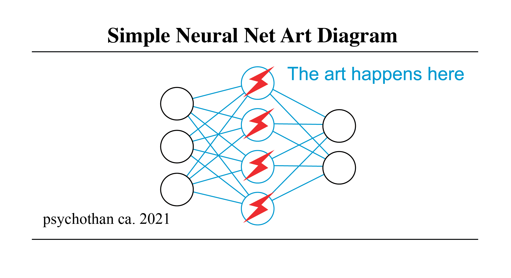

# Awesome AI Art 

> Resources at the intersection of AI _AND_ Art. Mainly tools and tutorials but also with some inspiring people and places thrown in too!

For a broader resource covering more general creative coding tools (that you might want to use with what is listed here), check out [terkelg/awesome-creative-coding](https://github.com/terkelg/awesome-creative-coding) or [thatcreativecode.page](https://thatcreativecode.page/). For resources on AI and deep learning in general, check out [ChristosChristofidis/awesome-deep-learning](https://github.com/ChristosChristofidis/awesome-deep-learning) and [https://github.com/dair-ai](https://github.com/dair-ai).

## Contents

* [Learning](#learning)
  * [Courses](#courses)
  * [Videos](#videos)
  * [Books](#books)
  * [Tutorials and Blogs](#tutorials-and-blogs)
<!-- * [Research]() -->
* [Products/Apps](#productsapps)
* [People](#people)
* [Places](#places)
* [Related Lists](#related-lists-and-collections)

> __bold__ entries signify my favorite resource(s) for that section/subsection (if I _HAD_ to choose a single resource). Additionally each subsection is usually ordered by specificity of content (most general listed first).

## Learning

### Courses

#### General Deep Learning

* [Practical Deep Learning for Coders (fast.ai)](https://course19.fast.ai/index.html)
* [Deep Learning (NYU)](https://atcold.github.io/pytorch-Deep-Learning/)
* [Introduction to Deep Learning (CMU)](https://deeplearning.cs.cmu.edu/F22/resources.html)
* ⭐️ __[Deep Learning for Computer Vision (UMich)](https://web.eecs.umich.edu/~justincj/teaching/eecs498/WI2022/)__
* [Deep Learning for Computer Vision (Stanford CS231n)](http://cs231n.stanford.edu/index.html)
* [Natural Language Processing with Deep Learning (Stanford CS224n)](https://web.stanford.edu/class/cs224n/)

#### Deep Generative Modeling

* [Deep Generative Models (Stanford)](https://deepgenerativemodels.github.io/)
* [Deep Unsupervised Learning (UC Berkeley)](https://sites.google.com/view/berkeley-cs294-158-sp20/home)
* [Differentiable Inference and Generative Models (Toronto)](http://www.cs.toronto.edu/~duvenaud/courses/csc2541/index.html)
* ⭐️ __[Learning-Based Image Synthesis (CMU)](https://learning-image-synthesis.github.io/sp22/)__
* [Learning Discrete Latent Structure (Toronto)](https://duvenaud.github.io/learn-discrete/)

#### Creative Coding and New Media

* ⭐️ __[Deep Learning for Art, Aesthetics, and Creativity (MIT)](https://ali-design.github.io/deepcreativity/)__
* [Introduction to Computational Media (ITP/NYU)](https://github.com/ITPNYU/ICM-2018)
* [Machine Learning for the Web (ITP/NYU)](https://github.com/yining1023/machine-learning-for-the-web)
* [New Media Installation: Art that Learns (CMU)](https://artthatlearns.wordpress.com/syllabus/)
* [Art and Machine Learning (CMU)](https://sites.google.com/site/artml2018/lectures)

### Videos

* ⭐️ __[The AI that creates any picture you want, explained (Vox)](https://youtu.be/SVcsDDABEkM)__
* [I Created a Neural Network and Tried Teaching it to Recognize Doodles (Sebastian Lague)](https://youtu.be/hfMk-kjRv4c)
* [Neural Network Series (3Blue1Brown)](https://www.youtube.com/playlist?list=PLZHQObOWTQDNU6R1_67000Dx_ZCJB-3pi)
* [Beginner's Guide to Machine Learning in JavaScript (Coding Train)](https://www.youtube.com/playlist?list=PLRqwX-V7Uu6YPSwT06y_AEYTqIwbeam3y)
* [Two Minute Papers](https://www.youtube.com/c/K%C3%A1rolyZsolnai)

### Books

* ⭐️ __[Dive into Deep Learning (Zhang, Lipton, Li, and Smola)](https://d2l.ai/index.html)__
* [Deep Learning (Goodfellow, Bengio, and Courville)](https://www.deeplearningbook.org/)
* [Computer Vision: Algorithms and Applications (Szeliski)](https://szeliski.org/Book/)
* [Programming Design Systems](https://programmingdesignsystems.com/)
* [Procedural Content Generation in Games](http://pcgbook.com/)

### Tutorials and Blogs

#### Deep Learning

* [Tutorial on Deep Generative Models (IJCAI-ECAI 2018)](https://ermongroup.github.io/generative-models/)
* [Tutorial on GANs (CVPR 2018)](https://sites.google.com/view/cvpr2018tutorialongans/)
* ⭐️ __[Lil'Log (Lilian Weng)](https://lilianweng.github.io/)__
* [Distill (on hiatus)](https://distill.pub/)

#### Generative Art

* ⭐️ __[Making Generative Art with Simple Mathematics](http://www.hailpixel.com/articles/generative-art-simple-mathematics)__
* [Book of Shaders: Generative Designs](https://thebookofshaders.com/10/)
* [Mike Bostock: Visualizing Algorithms](https://bost.ocks.org/mike/algorithms/) (with [Eyeo talk](https://vimeo.com/112319901))
* [Generative Examples in Processing](https://github.com/digitalcoleman/generativeExamples)
* [Generative Music](https://teropa.info/loop/#/title)

## Tools

### Generative Modeling

* ⭐️ __[Stable Diffusion]__(https://github.com/CompVis/stable-diffusion)
* [Transformers (🤗)](https://huggingface.co/docs/transformers/index)
* [Diffusers (🤗)](https://github.com/huggingface/diffusers)
* [Magenta](https://magenta.tensorflow.org/)
* [MediaPipe](https://google.github.io/mediapipe/)
* [Wekinator](http://www.wekinator.org/)
* [Tensorflow.js](https://js.tensorflow.org/)
* [ml5.js](https://ml5js.org/)
* [ofxAddons](http://ofxaddons.com/categories/14-machine-learning)

### Deep Learning Frameworks

* ⭐️ __[PyTorch](https://pytorch.org/)__
* [Keras](https://keras.io/)
* [Tensorflow](https://www.tensorflow.org/)
* [JAX](https://github.com/google/jax)
* [Darknet](https://pjreddie.com/darknet/)
* [dlib](http://dlib.net/)
* [Unity ML-Agents](https://unity3d.com/machine-learning)
* [Various existing GANs (vegans)](https://github.com/unit8co/vegans)

### Text-to-Image

* [VQGAN+CLIP](https://github.com/EleutherAI/vqgan-clip/tree/main/notebooks)
* [DALLE 2](https://github.com/lucidrains/DALLE2-pytorch)
* ⭐️ __[Stable Diffusion](https://github.com/CompVis/stable-diffusion)__
* [Imagen](https://github.com/lucidrains/imagen-pytorch)
* [Parti)](https://github.com/google-research/parti)
* [Stable Diffusion Prompt Search](https://lexica.art/)

### Creative Coding

> Not sure where to start/what to use, try [p5.js](https://p5js.org/) 🙌

#### Frameworks

* ⭐️ __[Processing (Java)](https://processing.org/) and [p5.js (Javascript)](https://p5js.org/)__
* [openFrameworks (C++)](http://openframeworks.cc/) 
* [Cinder (C++)](https://libcinder.org/)
* [nannou (Rust)](https://nannou.cc/)

#### Visual Programming Languages

* ⭐️ __[TouchDesigner](https://derivative.ca/)__
* [Max/MSP/Jitter](https://cycling74.com/products/max/)
* [vvvv](https://vvvv.org/)

#### Audio

* ⭐️ __[tone.js](https://tonejs.github.io/)__
* [Pure Data](https://puredata.info/)
* [Overtone](https://overtone.github.io/)
* [ChucK](http://chuck.cs.princeton.edu/)
* [Sonic Pi](https://sonic-pi.net/))

#### WebGL

> For a much much more extensive list see [sjfricke/awesome-webgl](https://github.com/sjfricke/awesome-webgl) 

* ⭐️ __[three.js](https://threejs.org/)__
* [regl](http://regl.party/)
* [stack.gl](http://stack.gl/) 

#### Text and NLP

* ⭐️ __[spacy](https://spacy.io/)__
* [natural](https://github.com/NaturalNode/natural)
* [Tracery](http://tracery.io/)

<!-- ## Research

### Foundational Papers

- [Learning Deep Generative Models (Salakhutdinov 2015)](https://www.cs.cmu.edu/~rsalakhu/papers/annrev.pdf)
- [Generative Adversarial Networks (Goodfellow 2015)]
- [Autoregressive]
- [Variational Autoencioders (Kingma 2014)]
- [Flow]()
- [Diffusion (Sacha)]
 -->

## Products/Apps

* [Artbreeder](https://www.artbreeder.com/)
* ⭐️ __[Dream Studio (Stability AI)](https://beta.dreamstudio.ai/)__
* [DALLE 2 (OpenAI)](https://openai.com/dall-e-2/)
* [Runway](https://runwayml.com/) - AI powered video editor.
* [Facet AI](https://facet.ai/) - AI powered image editor.
* [Adobe Sensei](https://www.adobe.com/sensei/creative-cloud-artificial-intelligence.html) - AI powered features for the Creative Cloud suite.
* [Alpaca](https://www.getalpaca.io/)
* [NVIDIA AI Demos](https://www.nvidia.com/en-us/research/ai-demos/)
* [ClipDrop](https://clipdrop.co/) and [cleanup.pictures](https://cleanup.pictures/)

## People

A non-exhaustive list of people doing interesting things at the intersection of art, ML, and design.

- [Memo Akten](http://www.memo.tv/works/)
- [Rebecca Fiebrink](https://www.doc.gold.ac.uk/~mas01rf/homepage/)
- [Tom White](https://drib.net/)
- [Hannah Davis](http://www.hannahishere.com/)
- [Mario Klingemann](http://quasimondo.com/)
- [Robbie Barrat](https://robbiebarrat.github.io/)
- [Mimi Onuoha](http://mimionuoha.com/)
- [Gene Kogan](http://genekogan.com/)
- [Allison Parrish](https://www.decontextualize.com/)
- [Refik Anadol](http://refikanadol.com/)
- [Tega Brain](http://tegabrain.com/)
- [Kyle McDonald](http://kylemcdonald.net/)
- [Mike Tyka](http://www.miketyka.com/)
- [Lauren McCarthy](http://lauren-mccarthy.com/)
- [Dan Shiffman](https://shiffman.net/)
- [Molly Wright Steenson](http://www.girlwonder.com/)
- [Ken Goldberg](https://goldberg.berkeley.edu/)
- [Eric Paulos](http://www.paulos.net/index.html)
- [Golan Levin](http://www.flong.com/)
- [Trevor Paglen](https://paglen.studio/)

## Places

- [STUDIO for Creative Inquiry](http://studioforcreativeinquiry.org/)
- [ITP](https://tisch.nyu.edu/itp)
- [Gray Area Foundation for the Arts](https://grayarea.org/)
- [Berkeley Center for New Media](http://bcnm.berkeley.edu/)
- [Goldsmiths](https://www.gold.ac.uk/computing/)
- [Google Artists and Machine Intelligence](https://ami.withgoogle.com/)
- [Google Creative Lab](https://www.creativelab5.com/)
- [The Lab at the Google Cultural Institute](https://www.google.com/culturalinstitute/thelab/)
- Sony CSL ([Tokyo](https://www.sonycsl.co.jp/) and [Paris](https://csl.sony.fr/))
- [The Brown Institute](https://brown.columbia.edu/)
- [UCLA Design Media Arts](http://dma.ucla.edu/)
- [Stability AI (Eleuther, LAION, et al.)](https://stability.ai/)

## Related lists and collections

* [Machine Learning for Art](https://ml4a.net/)
* [Tools and Resources for AI Art (pharmapsychotic)](https://pharmapsychotic.com/tools.html) - Big list of Google Colab notebooks for generative text-to-image techniques as well as general tools and resources.

## Contributing

Contributions welcome! Read the [contribution guidelines](contributing.md) first.
