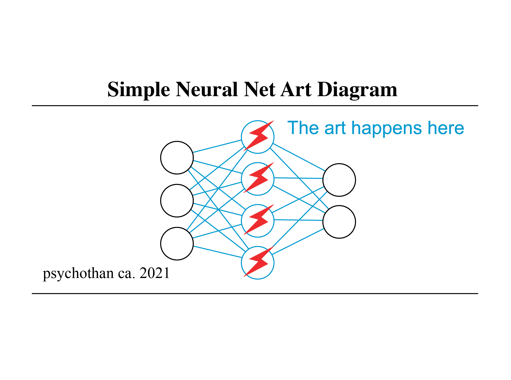

> Part art, part AI.... all fun!

# Artificial Intelligence for Art and Design

This repo exists as part curriculum and part textbook for Jonathan's Art and machine learning virtual "course". The course is mainly an indefinite [Twitch](https://www.twitch.tv/thedatawarehaus) series in the form of live lectures/workshops. Recordings of the streams will be edited and augmented (with better graphics) and posted to [YouTube](https://www.youtube.com/channel/UCi0Hd3U6xb4V0ApUhAIfu9Q) as VODs. Lecture notes and exercises will form an informal interactive textbook and reference if reading is more your speed. 

__Whether you are an artist or designer looking to augment your practice with machine learning or a ML engineer/researcher wanting to make creative applications there should be something for you here!__

<!-- ## Materials

Feel free to engage with as many (or as few) of these resources as you want.

| Live | Notes/Exercises/Examples | Recordings | Forum | Chat |
|:--:|:--:|:--:|:--:|:--:|
| [Twitch](https://www.twitch.tv/thedatawarehaus) | [This repo!](#) | [YouTube](https://www.youtube.com/channel/UCi0Hd3U6xb4V0ApUhAIfu9Q) | [Github Discussions](#) | [Discord](https://discord.gg/kA8vFDUkr5) |

## Prerequisites

- Experience with a scripting language, e.g., Javascript or Python (all code demos will be in Javascript).
- Familiarity with the data science process and machine learning are a plus. -->

## (tentative) Outline

Application first applied workshops.

| | Topic | Readings | Lecture/Demo | Exercise |
|:-:|:-:|:-:|:-:|:--:|
| 1 | Intro to ML | TBD | <ul><li>Machine learning Process</li><li>All things Data</li></ul> | [Teachable Machine](https://teachablemachine.withgoogle.com/) |
| 2 | Generative Models | TBD | | |
| 3 | Image Synthesis | TBD | | |
| 4 | | TBD | | |
| 5 | | TBD | | |
| 6 | | TBD | | |
| 7 | | TBD | | |
| 8 | Multimodal Applications | TBD | | |

## Getting Help

## Resources

Art and Machine Learning resources and references (with some new media thrown in).

### Courses (loosely defined)

* [Machine Learning for Artists](https://ml4a.github.io/classes/)
* ITP @ NYU: [Machine Learning for the Web](https://github.com/yining1023/machine-learning-for-the-web)
* ITP @ NYU: [Introduction to Computational Media](https://github.com/ITPNYU/ICM-2018)
* Kadenze: [Creative Applications of Deep Learning with TensorFlow](https://www.kadenze.com/programs/creative-applications-of-deep-learning-with-tensorflow)
* Kadenze: [Generative Art and Computational Creativity](https://www.kadenze.com/programs/generative-art-and-computational-creativity)
* CMU: [Art and Machine Learning](https://sites.google.com/site/artml2018/lectures)
* CMU: [New Media Installation: Art that Learns](https://artthatlearns.wordpress.com/syllabus/)
* Coding Train: [Youtube Playlists](https://www.youtube.com/user/shiffman/playlists?shelf_id=16&sort=dd&view=50)

### Creative Coding Tools

Here is a list of some common creative coding libraries (not including machine learning specific libraries).

- Processing ([Java](https://processing.org/), [p5.js](https://p5js.org/), and [processing.py](http://py.processing.org/))
- HTML/Javascript ([canvas](https://developer.mozilla.org/en-US/docs/Web/API/Canvas_API/Tutorial) and [two.js](https://two.js.org/))
- 3D/[WebGL](https://github.com/sjfricke/awesome-webgl) ([three.js](https://threejs.org/), [regl](http://regl.party/), [stack.g](http://stack.gl/)l, [Mathbox](https://github.com/unconed/mathbox))
- Interactive & Installation ([openFrameworks](http://openframeworks.cc/) and [Cinder](https://libcinder.org/))
- Audio ([tone.js](https://tonejs.github.io/), [Max](https://cycling74.com/products/max/), [Pure Data](https://puredata.info/), [Overtone](https://overtone.github.io/), [ChucK](http://chuck.cs.princeton.edu/), [Sonic Pi](https://sonic-pi.net/))
- Text ([spacy](https://spacy.io/), [natural](https://github.com/NaturalNode/natural), [Tracery](http://tracery.io/))

> Not sure where to start/what to use, try [p5.js](https://p5js.org/) or [processing.py](http://py.processing.org/) 🙌

### Machine Learning Tools (for making art)

* [Wekinator](http://www.wekinator.org/)
* [Magenta](https://magenta.tensorflow.org/)
* [Runway](https://runwayapp.ai/)
* [Tensorflow.js](https://js.tensorflow.org/)
* [ml5.js](https://ml5js.org/)
* [ofxAddons](http://ofxaddons.com/categories/14-machine-learning)

#### General purpose frameworks/libraries

* [PyTorch](https://pytorch.org/)
* [Tensorflow](https://www.tensorflow.org/)
* [Keras](https://keras.io/)
* [Darknet](https://pjreddie.com/darknet/)
* [dlib](http://dlib.net/)
* [CNTK](https://www.microsoft.com/en-us/cognitive-toolkit/) (with [C# interface](https://docs.microsoft.com/en-us/cognitive-toolkit/using-cntk-with-csharp))
* [scikit-learn](https://scikit-learn.org/stable/)
* [Unity ML-Agents](https://unity3d.com/machine-learning)
* [Various existing GANs (vegans)](https://github.com/unit8co/vegans)

### Google Colab Examples/Documentation

- [Getting Started with Google Colab (and running your first network)](https://colab.research.google.com/drive/1TzaPS3jvRadN-URLbQ9nD1ZNoZktfNRy)
- [pix2pix Walkthrough](https://drive.google.com/file/d/16UoYX16K_cuXjEdd29zm1ZEMwEE4OSPI/view?usp=sharing)

#### Semi-official Google Contributed

- [Hello, Colaboratory](https://colab.research.google.com/notebooks/welcome.ipynb)
- [Overview of Colaboratory Features](https://colab.research.google.com/notebooks/basic_features_overview.ipynb)
- [Importing Libraries](https://colab.research.google.com/notebooks/snippets/importing_libraries.ipynb)
- [External data: Drive, Sheets, and Cloud Storage](https://colab.research.google.com/notebooks/io.ipynb)
- [Getting Started with BigQuery](https://colab.research.google.com/notebooks/bigquery.ipynb)
- [Tensorflow with GPU](https://colab.research.google.com/notebooks/gpu.ipynb)
- [Charts in Colaboratory](https://colab.research.google.com/notebooks/charts.ipynb)
- [Markdown Guide](https://colab.research.google.com/notebooks/markdown_guide.ipynb)
- [MusicVAE](https://colab.research.google.com/notebooks/magenta/music_vae/music_vae.ipynb)

### Interactive ML Embedding Examples

Here are some fun interactive embedding visualizations from Google's AI Experiments, hopefully they also give some intuition about high dimensional spaces and what embedding does to them:

- [Tensorflow Embedding Projector](http://projector.tensorflow.org/)
- [NSynth Super](https://nsynthsuper.withgoogle.com/)
- [IDEO Font Map](http://fontmap.ideo.com/)
- [Infinite Drum Machine](https://experiments.withgoogle.com/ai/drum-machine/view/)
- [Bird Sounds](https://experiments.withgoogle.com/ai/bird-sounds/view/)

### Generative, Procedural, and Algorithmic Art Tutorials

Here are some examples/tutorials on creating generative, procedural, or algorithmic art/designs using code.

- [Making Generative Art with Simple Mathematics](http://www.hailpixel.com/articles/generative-art-simple-mathematics)
- [https://medium.com/@zachlieberman/daily-sketches-in-2017-1b4234b0615d](https://medium.com/@zachlieberman/daily-sketches-in-2017-1b4234b0615d)
- [Mike Bostock: Visualizing Algorithms](https://bost.ocks.org/mike/algorithms/) (with [Eyeo talk](https://vimeo.com/112319901))
- [Generative Examples in Processing](https://github.com/digitalcoleman/generativeExamples)
- [Book of Shaders: Generative Designs](https://thebookofshaders.com/10/)
- [Programming Design Systems](https://programmingdesignsystems.com/)
- [Generative Music](https://teropa.info/loop/#/title)
- [Procedural Content Generation in Games](http://pcgbook.com/)

### People

A non-exhaustive list of people doing interesting things at the intersection of art, ML, and design.

* Memo Akten ([website](http://www.memo.tv/works/) and [blog](https://medium.com/@memoakten))
* [Rebecca Fiebrink](https://www.doc.gold.ac.uk/~mas01rf/homepage/)
* [Tom White](https://drib.net/)
* [Hannah Davis](http://www.hannahishere.com/)
* [Mario Klingemann](http://quasimondo.com/)
* [Robbie Barrat](https://robbiebarrat.github.io/)
* [Mimi Onuoha](http://mimionuoha.com/)
* [Gene Kogan](http://genekogan.com/)
* [Allison Parrish](https://www.decontextualize.com/)
* [Refik Anadol](http://refikanadol.com/)
* [Tega Brain](http://tegabrain.com/)
* [Kyle McDonald](http://kylemcdonald.net/)
* [Mike Tyka](http://www.miketyka.com/)
* [Lauren McCarthy](http://lauren-mccarthy.com/)
* [Dan Shiffman](https://shiffman.net/)
* [Molly Wright Steenson](http://www.girlwonder.com/)
* [Ken Goldberg](https://goldberg.berkeley.edu/)
* [Eric Paulos](http://www.paulos.net/index.html)
* [Golan Levin](http://www.flong.com/)

### Places

* [STUDIO for Creative Inquiry](http://studioforcreativeinquiry.org/)
* [ITP](https://tisch.nyu.edu/itp)
* [Gray Area Foundation for the Arts](https://grayarea.org/)
* [Berkeley Center for New Media](http://bcnm.berkeley.edu/)
* [Goldsmiths](https://www.gold.ac.uk/computing/)
* [Google Artists and Machine Intelligence](https://ami.withgoogle.com/)
* [Google Creative Lab](https://www.creativelab5.com/)
* [The Lab at the Google Cultural Institute](https://www.google.com/culturalinstitute/thelab/)
* Sony CSL: [Tokyo](https://www.sonycsl.co.jp/) and [Paris](https://csl.sony.fr/)
* [The Brown Institute](https://brown.columbia.edu/)
* [UCLA Design Media Arts](http://dma.ucla.edu/)

## LICENSE

This work by <a rel="cc:attributionURL dct:creator" property="cc:attributionName" href="https://jonathanjonathanjonathan.com">Jonathan Dinu</a> is licensed under <a href="http://creativecommons.org/licenses/by/4.0/?ref=chooser-v1" target="_blank" rel="license noopener noreferrer" style="display:inline-block;">CC BY 4.0</a>

### You are free to:

- **Share** — copy and redistribute the material in any medium or format
- **Adapt** — remix, transform, and build upon the material
  for any purpose, even commercially.

_The licensor cannot revoke these freedoms as long as you follow the license terms._

### Under the following terms:

- **Attribution** — You must give appropriate credit, provide a link to the license, and indicate if changes were made. You may do so in any reasonable manner, but not in any way that suggests the licensor endorses you or your use.
- **No additional restrictions** — You may not apply legal terms or technological measures that legally restrict others from doing anything the license permits.

### Notices:

You do not have to comply with the license for elements of the material in the public domain or where your use is permitted by an applicable exception or limitation.

No warranties are given. The license may not give you all of the permissions necessary for your intended use. For example, other rights such as publicity, privacy, or moral rights may limit how you use the material.
